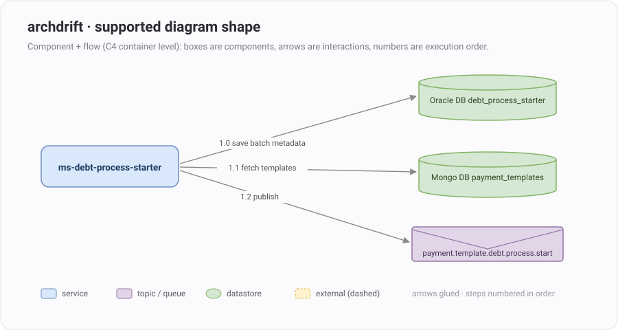

<div align="center">

# 🧭 archdrift

**Your architecture diagram is a contract. This makes it executable.**

One Python file that diffs a Spring Boot microservice against its draw.io HLD
and prints *expected vs actual*, side by side, with a match %.


-success?style=flat-square)


</div>

---

## Why

Diagrams rot. Someone renames a Kafka topic, adds a Feign client, reorders the flow —
and the HLD quietly becomes fiction. This gate runs pre-merge and fails the build
when the code and the diagram stop telling the same story. Either fix the code
or update the diagram; both are wins.

## Quick start

### 1 · Fill in your values

| Field | Your value | What it is |
|-------|------------|------------|
| `<API_KEY>` | `sk-ant-...` | Anthropic API key — [get one here](https://platform.claude.com) |
| `<MS_PATH>` | `/full/path/to/ms-your-service` | microservice repo root |
| `<DIAGRAM_PATH>` | `/full/path/to/your-HLD.drawio` | the draw.io HLD file |
| `<MODEL>` | `claude-sonnet-5` | `claude-haiku-4-5` for cheap iteration, `claude-sonnet-5` for the real gate |

### 2 · Plug them into the command

```bash
export ANTHROPIC_API_KEY=<API_KEY>

uv run archdrift.py <MS_PATH> <DIAGRAM_PATH> --model <MODEL>
```

**Concrete example** — a payments service against its subsystem HLD:

```bash
export ANTHROPIC_API_KEY=sk-ant-api03-xxxxx

uv run archdrift.py \
  ~/dev/payments/ms-debt-process-starter \
  ~/diagrams/auto-payments-HLD.drawio \
  --model claude-haiku-4-5
```

No `uv`? Plain Python 3.12+ works the same:

```bash
pip install anthropic rich
python archdrift.py <MS_PATH> <DIAGRAM_PATH> --model <MODEL>
```

### 3 · Optional: set-and-forget

Every flag reads an `ARCHDRIFT_*` env var — export once in your shell profile and every future run is zero-argument:

```bash
# ~/.zshrc / ~/.bashrc
export ANTHROPIC_API_KEY="sk-ant-..."
export ARCHDRIFT_MS="<MS_PATH>"
export ARCHDRIFT_DIAGRAM="<DIAGRAM_PATH>"
export ARCHDRIFT_MODEL="<MODEL>"

# optional: validate live runtime config too
export ARCHDRIFT_CONSUL_URL="http://localhost:8500/v1/kv/config/{project}/{service}/application-{profile}/data?raw=true"
export ARCHDRIFT_PROJECT="your-project"
```

```bash
uv run archdrift.py        # that's the whole command now
```

## How it works

```
.drawio ──parse──▶ scope to YOUR service's arrows ─┐
Java + gradle + yml ──harvest──────────────────────┼──▶ AI audit ──▶ deterministic score
Consul KV (live, optional) ──fetch─────────────────┘      │
                     deterministic guards ────────────────┘   (renames, step order, unglued arrows)
```

The diagram is auto-scoped to the target service — only arrows in/out of it count,
the rest of the subsystem is other teams' story. The AI produces evidence rows;
the score is computed in Python. The model never grades itself, and the checks
that must never be missed (renamed identifiers, duplicate step numbers, arrows
that *look* attached but aren't glued) run as pure code, on any model tier.

## What counts as architecture

Exactly what a diagram can draw — nothing else is judged:

| Dimension  | Weight | The question it answers |
|------------|:------:|-------------------------|
| Components | 40%    | is every box real, and every real integration drawn? |
| Flows      | 35%    | does every arrow run the drawn direction + mechanism, and do numbered steps (`1.0 → 1.1 → 1.2`) execute in that order? |
| Contracts  | 25%    | do bound names (topics, Feign ids, DB names) equal the labels **character for character**? |

## Supported diagram shape

archdrift reads a **component + flow diagram** (C4 container level) — boxes are
architecture components, arrows are interactions, numbers are execution order.
It does *not* read class diagrams, sequence diagrams, or free-form sketches.



Open [`sample-hld.drawio`](sample-hld.drawio) in [diagrams.net](https://app.diagrams.net) as a starting template. Rules the gate relies on:

- **Boxes = components** — the service, Kafka topics/queues, datastores, caches, schedulers, external systems/clients. Nothing at class level.
- **Glue every arrow to both boxes** — an endpoint that only *touches* a shape isn't connected; the gate can't see a floating arrow and warns you where the loose head sits.
- **One arrow per interaction** — many consumer/producer classes on one topic are a single edge. Label genuinely distinct concerns separately (e.g. `payment.outbox: state-changed` / `auto-clearing`).
- **Number this service's own steps** `1.0`, `1.1`, `1.2` … in execution order — the code must run them in that order.
- **Put the expected namespace in brackets** — `ms-card [birbank-backend]`; a resolved value in another namespace is flagged as drift.

### Keeping your organisation out of the payload

`--redact acmecorp,internal.host` replaces those strings with neutral tokens (`org1`, `org2`) in everything sent to the model — package prefixes, hostnames, anything — and maps them back locally, so the report you read still shows the real names. Class names are untouched, since the audit matches them against your diagram labels.

```bash
export ARCHDRIFT_REDACT="acmecorp,internal.host"
```

## Config

CLI args always beat env vars.

| Flag           | Env var               | Default             | Purpose |
|----------------|-----------------------|---------------------|---------|
| `root` (arg 1) | `ARCHDRIFT_MS`          | —                   | microservice repo path |
| `diagram` (arg 2) | `ARCHDRIFT_DIAGRAM`  | —                   | HLD `.drawio` path |
| `--service`    | `ARCHDRIFT_SERVICE`     | repo directory name | service name for scoping + Consul path |
| `--project`    | `ARCHDRIFT_PROJECT`     | —                   | Consul KV project segment |
| `--profile`    | `ARCHDRIFT_PROFILE`     | `preprod`           | Consul profile to validate |
| `--consul-url` | `ARCHDRIFT_CONSUL_URL`  | —                   | KV url template (`{project}/{service}/{profile}`) |
| `--redact`     | `ARCHDRIFT_REDACT`    | —                   | mask identifiers before send, e.g. `acmecorp,internal.host` |
| `--no-consul`  | —                     | off                 | skip runtime-config validation |
| `--threshold`  | `ARCHDRIFT_THRESHOLD`   | `70`                | minimum match % before exit `1` |
| `--model`      | `ARCHDRIFT_MODEL`       | `claude-sonnet-5`   | `claude-haiku-4-5` for cheap iteration |

Consul URL set and reachable → runtime config is validated (the report names the exact KV path).
Unset or unreachable → one yellow line, config checks skipped, run continues.

## CI

```bash
uv run archdrift.py "$CI_PROJECT_DIR" hld/service.drawio --threshold 70
# exit 0 → merge · exit 1 → drift: fix the code or update the diagram
```

## Output

```
────────────────── ARCHITECTURE MATCH · ms-debt-process-starter ──────────────────
 DIMENSION      WEIGHT   MATCH
 Components       40%     100%   ████████████████████
 Flows            35%     100%   ████████████████████
 Contracts        25%     100%   ████████████████████

       HLD EXPECTED                          SRC ACTUAL
 ●     1.0 save batch job metadata → Oracle  JobRepository persists — TemplateProcessConfig
 ●     1.1 fetch templates → Mongo           TemplateDataItemReader pages templates
 ●     1.2 send process started → topic      ThreadSafeKafkaItemWriter publishes event

┏━ VERDICT ━━━━━━━━━━━━━━━━━━━━━━━━━━━━━━━━━━━━━━━━━━━━━━━━━━━━━━━━━━━━━━━━━━━┓
┃ MATCH 100%  CLEAN  ·  gate 70%                                              ┃
┗━━━━━━━━━━━━━━━━━━━━━━━━━━━━━━━━━━━━━━━━━━━━━━━━━━━━━━━━━━━━━━━━━━━━━━━━━━━━━┛
```

Grades: `CLEAN` ≥ 90 · `PASSING` ≥ gate · `DRIFTING` ≥ 50 · `BROKEN` below.

## Drawing conventions the gate understands

- **labels on arrows** become the flow mechanism the audit verifies
- **numbered labels** (`1.0 …`, `1.1 …`) on your service's arrows define the intended execution order
- **glue your arrows** — an endpoint that merely *touches* a shape isn't connected;
  the gate warns and names the shape the loose head is sitting on
- values behind `${...}` / Vault are invisible on purpose and never counted against you

---

<sub>Single file, inline deps ([PEP 723](https://peps.python.org/pep-0723/)), stdlib XML parsing, structured-output AI audit, deterministic scoring. Bring an [Anthropic API key](https://platform.claude.com) and a diagram you're willing to keep honest.</sub>
